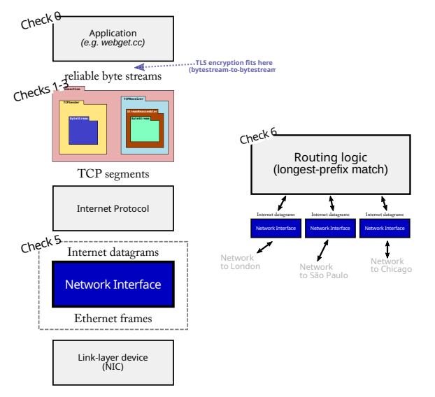

# Internet Stack

> [!IMPORTANT]
> The code here is offered as a learning aid to help you build intuition and see one possible way of solving the problem. Please treat it as a starting point for your own thinking rather than a solution to hand in.

Implemented Components:

| # | Title | Description | Links |
| - | - | - | - |
| 1 | ByteStream | In-memory flow-controlled byte stream | Source Code: [src/byte_stream.cc](src/byte_stream.cc) |
| 2 | Reassmebler | Stitch substrings into byte stream for againsting reording and duplication | Source Code: [src/reassembler.cc](src/reassembler.cc); Explanation: [writeups/check1.md](writeups/check1.md) |
| 3 | TCP Receiver | Receive messages from the sender, reassemble the byte stream (including its ending, when that occurs), and determine that messages that should be sent back to the sender for acknowledgement and flow control | Source Code: [src/tcp_receiver.cc](src/tcp_receiver.cc) |
| 4 | TCP Sender | Responsible for reading from a ByteStream (created and written to by some sender-side application), and turning the stream into a sequence of outgoing TCP segments | Source Code: [src/tcp_sender.cc](src/tcp_sender.cc) |
| 5 | Network Interface | Translate the datagram into an Ethernet frame and (eventually) send it & run the address resolution Protocol | Source Code: [src/network_interface.cc](src/network_interface.cc) |
